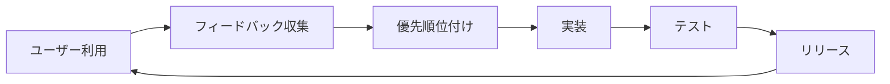

# GitHub公開計画

## 公開するもの

### リポジトリ名候補

1. `adaptive-claude-agents` ⭐️ 推奨
2. `claude-code-adaptive-framework`
3. `smart-claude-subagents`

**推奨理由**: 「adaptive」が主要な差別化ポイントを表現

### リポジトリ構成

```
adaptive-claude-agents/
├── README.md                    # メインドキュメント
├── LICENSE                      # MITライセンス
├── CONTRIBUTING.md              # コントリビューションガイド
├── install.sh                   # インストールスクリプト
├── docs/
│   ├── getting-started.md       # はじめに
│   ├── configuration.md         # 設定方法
│   ├── templates-guide.md       # テンプレート作成ガイド
│   ├── troubleshooting.md       # トラブルシューティング
│   └── ja/                      # 日本語ドキュメント
│       ├── README.md
│       └── getting-started.md
├── skills/                      # Claude Skills実装
│   ├── project-analyzer/
│   │   ├── SKILL.md
│   │   ├── analyze_project.py
│   │   ├── detect_stack.py
│   │   └── generate_agents.py
│   └── adaptive-review/
│       ├── SKILL.md
│       └── phase_detector.py
├── templates/                   # サブエージェントテンプレート
│   ├── nextjs/
│   ├── fastapi/
│   ├── react-native/
│   ├── go/
│   └── README.md
├── examples/                    # 使用例
│   ├── nextjs-project/
│   ├── fastapi-project/
│   └── README.md
└── tests/                       # テスト
    └── test_analyzer.py
```

## 公開戦略

### Phase 1: ソフトローンチ（1-2週間）

**目標**: 限定的なフィードバック収集

- [ ] プライベートリポジトリ作成
- [ ] 5-10人のベータテスター募集
  - Claude Codeヘビーユーザー
  - 異なる技術スタック使用者
- [ ] フィードバック収集と改善

**チャネル**:

- 個人的なつながり
- 関連Discordサーバー

### Phase 2: 公開ベータ（2-3週間）

**目標**: コミュニティからの幅広いフィードバック

- [ ] パブリックリポジトリに変更
- [ ] r/ClaudeAI に投稿
- [ ] Claude Code公式Discordで共有
- [ ] Twitter/X で発表

**投稿例**:

```
🚀 Introducing Adaptive Claude Agents

Automatically generates project-specific subagents and adjusts
review rigor based on development phase (prototype → MVP → production).

First tool to bring traditional software QA principles to AI agents!

[GitHub Link]
```

### Phase 3: 正式リリース（1-2週間後）

**目標**: 広範な採用

- [ ] v1.0.0 リリース
- [ ] ブログ記事公開（Medium、dev.to、Zenn）
- [ ] デモビデオ作成
- [ ] Anthropic公式への提案検討

## 懸念点と対策

### 懸念1: 既存ツールとの重複

**懸念内容**:

- `claude-init`と機能が重複
- 「なぜ新しいツールが必要？」という疑問

**対策**:

```markdown
## 既存ツールとの違い

| 特徴 | claude-init | Adaptive Claude Agents |
|------|-------------|----------------------|
| 実行タイミング | 初期セットアップのみ | 常時動作（Skillsベース） |
| フェーズ適応 | なし | **あり（独自機能）** |
| 更新頻度 | プロジェクト開始時 | 継続的 |
| 統合方法 | CLIツール | Claude Skills |
```

**明確な差別化**:

1. **グローバルSkillsとしての統合** - 常時動作
2. **開発フェーズ適応** - 完全に新規の機能
3. **Progressive Disclosure** - Anthropicの推奨パターンに準拠

### 懸念2: 技術スタック判定の精度

**懸念内容**:

- 誤判定による不適切なエージェント生成
- ユーザーの信頼低下

**対策**:

1. **確認プロンプト**

   ```
   検出: Next.js + TypeScript + Tailwind
   以下のエージェントを生成しますか？
   - nextjs-tester
   - component-reviewer
   - type-checker
   [y/N]
   ```

2. **手動上書き機能**

   ```markdown
   # .claude/project.yml
   stack_override:
     - nextjs
     - typescript
   ```

3. **判定ロジックの透明性**
   - 判定理由をログに記録
   - ドキュメントで判定基準を公開

### 懸念3: メンテナンスの負担

**懸念内容**:

- 多数のテンプレート管理
- 技術スタックの変化への追従
- コミュニティからの要望対応

**対策**:

1. **コミュニティ駆動の開発**
   - テンプレート追加をPR歓迎
   - CONTRIBUTING.mdで明確なガイドライン

2. **モジュール設計**
   - 各テンプレートが独立
   - 新規追加が容易

3. **優先順位付け**
   - 人気の技術スタックから対応
   - GitHub Discussionsで要望収集

### 懸念4: Anthropic公式との競合

**懸念内容**:

- 公式が似た機能をリリース
- プロジェクトの価値低下

**対策**:

1. **オープンソースの強み**
   - カスタマイズ可能
   - コミュニティ駆動の改善

2. **公式への貢献**
   - アイデアを公式に提案
   - 公式実装のベースになる可能性

3. **差別化の維持**
   - 独自機能（フェーズ適応）の強化
   - ニッチなユースケース対応

### 懸念5: ライセンスとクレジット

**懸念内容**:

- 既存テンプレートの使用
- コミュニティ作成テンプレートの権利

**対策**:

1. **明確なライセンス**
   - MIT License使用
   - LICENSE.mdで権利を明記

2. **クレジット表記**

   ```markdown
   ## Credits

   This project is inspired by:
   - claude-init by @dimitritholen
   - awesome-claude-code-subagents by @VoltAgent

   Individual template credits in each file.
   ```

3. **CONTRIBUTING.md**

   ```markdown
   ## Submitting Templates

   By submitting a template, you agree to:
   - License under MIT
   - Allow modifications
   - Credit will be given in the template file
   ```

## マーケティング計画

### ブログ記事（優先順位順）

1. **"Adaptive Code Review: Bringing QA Best Practices to AI Agents"**
   - Medium、dev.to
   - フェーズ適応の重要性を説明
   - 実例とベンチマーク

2. **"Auto-generating Claude Code Subagents from Project Structure"**
   - Zenn（日本語）
   - 技術的な詳細
   - 実装解説

3. **"Why Your AI Code Reviewer Should Care About Development Phases"**
   - 一般向け
   - ソフトウェア開発の原則

### デモビデオ

**シナリオ**:

1. 新規Next.jsプロジェクト作成
2. Claude Code起動
3. 自動的にサブエージェント生成
4. フェーズ変更（プロトタイプ→本番）
5. レビュー基準の変化を実演

**時間**: 3-5分

### コミュニティエンゲージメント

**定期的なアップデート**:

- 週次: GitHub Issues/PRの確認
- 月次: コミュニティフィードバックのまとめ
- 四半期: 大きな機能追加

**フィードバック収集**:

- GitHub Discussions
- アンケート（Google Forms）
- 直接のユーザーインタビュー

## 成功指標（KPI）

### 3ヶ月目標

- [ ] GitHub Stars: 100+
- [ ] 実装プロジェクト: 20+
- [ ] コントリビューター: 5+
- [ ] テンプレート数: 10+

### 6ヶ月目標

- [ ] GitHub Stars: 500+
- [ ] 実装プロジェクト: 100+
- [ ] コントリビューター: 15+
- [ ] テンプレート数: 20+
- [ ] ブログ記事: 5+
- [ ] 他のClaude Codeツールとの連携

### 1年目標

- [ ] GitHub Stars: 1000+
- [ ] Claude Code公式ドキュメントでの言及
- [ ] 他のAIエージェントフレームワークへの移植検討

## リスク管理

### 技術的リスク

#### リスク1: LSP/言語サーバーとの競合

**発生確率**: 中
**影響度**: 高

**詳細**:

- Claude Codeが内部的に使用する言語サーバーとの競合
- 自動生成されたエージェントが誤った解析結果を生成

**対策**:

- 言語サーバーの結果を優先する設計
- 競合検出メカニズムの実装
- フォールバックオプションの提供

#### リスク2: Claude Codeのアップデートによる破損

**発生確率**: 中
**影響度**: 中

**詳細**:

- Anthropicの仕様変更
- Skillsフォーマットの変更
- サブエージェントAPIの変更

**対策**:

- バージョンピン留め機能
- 互換性テストの自動化
- マイグレーションガイド提供

#### リスク3: 大規模プロジェクトでのパフォーマンス問題

**発生確率**: 高
**影響度**: 中

**詳細**:

- モノレポでの分析時間増大
- エージェント生成の遅延
- メモリ使用量の増加

**対策**:

```yaml
# .claude/adaptive-config.yml
performance:
  max_analysis_depth: 3
  exclude_dirs:
    - node_modules
    - .git
    - dist
  cache_analysis: true
  cache_ttl: 86400  # 24時間
```

### コミュニティリスク

#### リスク1: 悪意あるテンプレートの投稿

**発生確率**: 低
**影響度**: 高

**詳細**:

- セキュリティリスクを含むテンプレート
- 意図的に誤った動作をするエージェント

**対策**:

1. **レビュープロセス**
   - 全PRにコードレビュー必須
   - セキュリティチェックリスト
   - メンテナーによる承認

2. **テンプレート検証**

   ```python
   # 自動チェックスクリプト
   - 危険なコマンド検出
   - 外部通信の検証
   - ファイルシステム操作の監査
   ```

3. **サンドボックス実行**
   - テンプレート動作確認環境
   - 制限された権限での実行

#### リスク2: コミュニティの分断

**発生確率**: 中
**影響度**: 中

**詳細**:

- 異なる方向性の提案
- フォークの乱立
- 標準化の困難

**対策**:

- 明確なガバナンスモデル
- ロードマップの透明性
- 定期的なコミュニティミーティング
- RFC（Request for Comments）プロセス

### ビジネス/法的リスク

#### リスク1: Anthropicの利用規約違反

**発生確率**: 低
**影響度**: 極高

**詳細**:

- 意図しない規約違反
- プロジェクトの停止要請

**対策**:

- 利用規約の定期的な確認
- Anthropicとの事前コミュニケーション
- 公式承認の取得検討

#### リスク2: 類似プロジェクトとの特許/知的財産権の問題

**発生確率**: 低
**影響度**: 高

**対策**:

- 先行技術調査の徹底
- MIT Licenseの適切な運用
- 弁護士への相談（必要時）

## 継続的改善計画

### フィードバックループ



**収集方法**:

1. GitHub Issues/Discussions
2. 月次アンケート（Google Forms）
3. Discord/Slack（オプション）
4. 使用統計（opt-in）

**分析指標**:

- テンプレート使用頻度
- エラー発生率
- 平均セットアップ時間
- ユーザー満足度（NPS）

### アップデート戦略

#### マイナーアップデート（月次）

- バグ修正
- 小規模な改善
- ドキュメント更新

#### メジャーアップデート（四半期）

- 新機能追加
- 新テンプレート
- パフォーマンス改善

#### ブレイキングチェンジ（年次以下）

- アーキテクチャ変更
- 非推奨機能の削除
- 移行ガイド必須

## 国際化（i18n）計画

### サポート言語

**Phase 1** (初期リリース):

- 英語（メイン）
- 日本語（作者の母語）

**Phase 2** (3ヶ月後):

- 中国語（簡体字）
- スペイン語
- フランス語

**Phase 3** (6ヶ月後):

- ドイツ語
- 韓国語
- ポルトガル語

### ドキュメント構成

```
docs/
├── en/              # 英語（デフォルト）
│   ├── README.md
│   ├── getting-started.md
│   └── templates-guide.md
├── ja/              # 日本語
│   ├── README.md
│   ├── getting-started.md
│   └── templates-guide.md
└── locales/         # UI文字列
    ├── en.json
    └── ja.json
```

## 協力・パートナーシップ

### 検討すべき連携先

1. **claude-init**
   - 相互補完的な関係
   - クロスプロモーション
   - 共通インターフェース検討

2. **awesome-claude-code-subagents**
   - テンプレート共有
   - ベストプラクティスの統合

3. **教育機関**
   - ソフトウェア工学の教材として
   - 研究プロジェクトとしての活用

4. **企業ユーザー**
   - エンタープライズサポート
   - カスタムテンプレート開発

## 長期ビジョン（2-3年）

### ビジョン1: AIエージェントのQA標準化

- 開発フェーズ適応が業界標準に
- 他のAIコーディングツール（Cursor、Cody等）への展開

### ビジョン2: 自己進化するエージェント

- 使用パターンから学習
- プロジェクト固有の最適化
- チームのコーディングスタイル学習

### ビジョン3: エコシステムの構築

- プラグインシステム
- マーケットプレイス
- 認定テンプレート制度

## 撤退基準

プロジェクトを中止する場合の明確な基準：

1. **技術的実現不可能性**
   - Anthropicの仕様変更により実装不可能
   - 致命的なセキュリティ問題が解決不可能

2. **コミュニティの無関心**
   - 3ヶ月間、新規Issueなし
   - 6ヶ月間、Stars増加なし
   - 実装プロジェクトが5以下

3. **メンテナンス負担過多**
   - 作者の時間確保が困難
   - 後継者が見つからない

**撤退時の責任**:

- アーカイブ化の告知（3ヶ月前）
- ドキュメントの保全
- フォークの推奨
- ユーザーへの移行ガイド

## チェックリスト: 公開前の最終確認

### コード品質

- [ ] 全スクリプトが動作確認済み
- [ ] エラーハンドリング実装済み
- [ ] ログ出力が適切
- [ ] セキュリティチェック完了

### ドキュメント

- [ ] README.mdが完成
- [ ] インストール手順が明確
- [ ] トラブルシューティングガイド
- [ ] API/設定リファレンス
- [ ] 日本語ドキュメント

### 法的・倫理

- [ ] LICENSE.md（MIT）
- [ ] CONTRIBUTING.md
- [ ] CODE_OF_CONDUCT.md
- [ ] Anthropic利用規約の確認
- [ ] プライバシーポリシー（データ収集する場合）

### コミュニティ

- [ ] GitHub Discussionsの有効化
- [ ] Issue/PRテンプレート
- [ ] ラベル設定
- [ ] GitHub Actions（CI/CD）
- [ ] README badgesの設定

### マーケティング

- [ ] デモGIF/ビデオ作成
- [ ] ブログ記事ドラフト
- [ ] SNS投稿準備
- [ ] r/ClaudeAI投稿ドラフト
- [ ] プレスリリース（オプション）

## まとめ

このGitHub公開計画は、単なるリリース戦略ではなく、**持続可能なオープンソースプロジェクト**を構築するための包括的なロードマップです。

**重要なポイント**:

1. ✅ 段階的な公開（ソフトローンチ → ベータ → 正式）
2. ✅ リスク管理の徹底
3. ✅ コミュニティ駆動の開発
4. ✅ 明確な成功指標と撤退基準
5. ✅ 長期ビジョンの設定

**次のアクション**:
[../CLAUDE.md](../CLAUDE.md) に記載されているPhase 1のタスク実装を開始し、このGitHub計画を並行して実行していきます。
