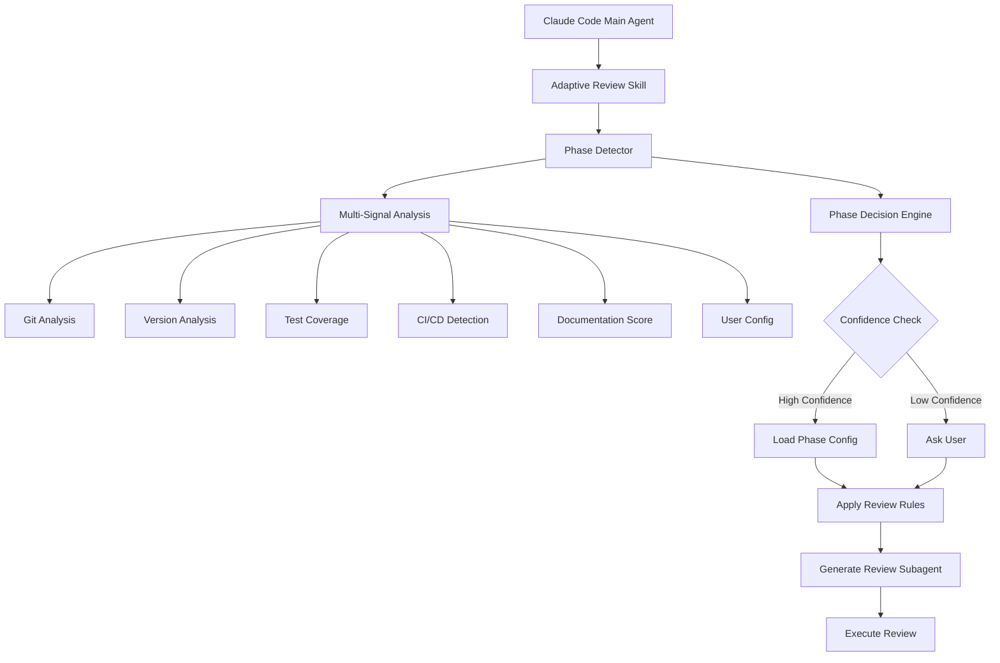
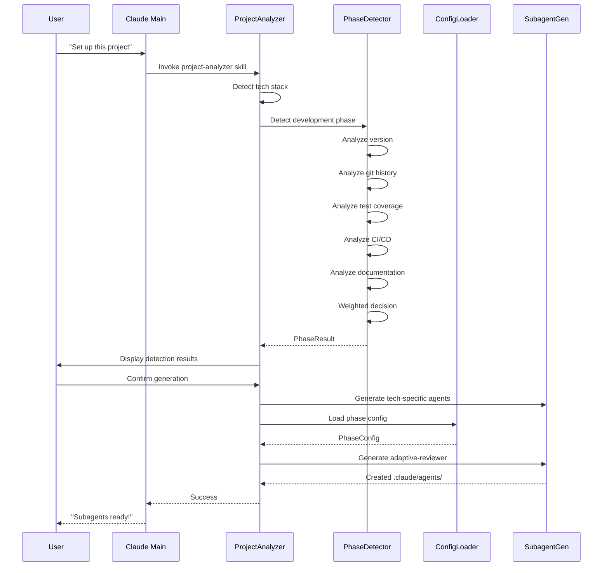

# Phase 3: Adaptive Review Rigor - Architecture Design

**Version**: 1.0.0
**Last Updated**: 2025-01-19
**Status**: Design Phase

---

## Table of Contents

1. [Executive Summary](#executive-summary)
2. [Architecture Overview](#architecture-overview)
3. [Phase Detection System](#phase-detection-system)
4. [Phase Configuration System](#phase-configuration-system)
5. [Integration Architecture](#integration-architecture)
6. [Skill Structure](#skill-structure)
7. [User Experience Flow](#user-experience-flow)
8. [Technical Implementation](#technical-implementation)
9. [Edge Cases and Error Handling](#edge-cases-and-error-handling)
10. [Success Criteria](#success-criteria)

---

## Executive Summary

### Purpose

Phase 3 implements the **most innovative feature** of Adaptive Claude Agents: automatically adjusting code review strictness based on development phase. This addresses a real-world problem where applying production-level review rigor to prototype code wastes time, while insufficient review of production code introduces risks.

### Key Innovation

Unlike existing code review tools that apply uniform standards, this system:
- **Automatically detects** the current development phase
- **Adapts review criteria** dynamically (prototype → MVP → production)
- **Provides phase-appropriate guidance** to Claude Code subagents

### Core Principle

> "Review rigor should match project maturity. Prototype code needs speed; production code needs perfection."

---

## Architecture Overview

### System Components



### Component Responsibilities

| Component | Responsibility | Output |
|-----------|---------------|--------|
| **Phase Detector** | Analyze project signals | Phase prediction + confidence |
| **Decision Engine** | Combine signals, resolve conflicts | Final phase determination |
| **Config Loader** | Load phase-specific rules | Review parameters |
| **Subagent Generator** | Create customized reviewer | Phase-aware subagent |

---

## Phase Detection System

### 1. Detection Algorithm

#### Pseudocode

```python
def detect_development_phase(project_path: Path) -> PhaseResult:
    """
    Multi-signal phase detection algorithm.

    Returns:
        PhaseResult with phase name, confidence, and reasoning
    """
    signals = {}

    # Signal 1: User explicit configuration (highest priority)
    user_phase = check_user_config(project_path / ".claude/phase.yml")
    if user_phase:
        return PhaseResult(
            phase=user_phase,
            confidence=1.0,
            source="user-explicit"
        )

    # Signal 2: Version number analysis
    signals['version'] = analyze_version(project_path)

    # Signal 3: Git history analysis
    signals['git'] = analyze_git_history(project_path)

    # Signal 4: Test coverage
    signals['test_coverage'] = analyze_test_coverage(project_path)

    # Signal 5: CI/CD maturity
    signals['ci_cd'] = analyze_ci_cd(project_path)

    # Signal 6: Documentation completeness
    signals['documentation'] = analyze_documentation(project_path)

    # Signal 7: Code structure maturity
    signals['structure'] = analyze_code_structure(project_path)

    # Combine signals with weighted voting
    phase = weighted_phase_decision(signals)
    confidence = calculate_confidence(signals)

    return PhaseResult(
        phase=phase,
        confidence=confidence,
        signals=signals,
        source="auto-detected"
    )
```

### 2. Detection Signals

#### Signal 1: User Configuration (.claude/phase.yml)

**Priority**: Highest (overrides all other signals)

**Format**:
```yaml
# .claude/phase.yml
phase: prototype  # or 'mvp' or 'production'
reason: "Still experimenting with core features"
last_updated: "2025-01-19"

# Optional: Custom rules override
custom_rules:
  enforce_type_safety: false
  require_tests: false
```

**Detection Logic**:
```python
def check_user_config(config_file: Path) -> Optional[str]:
    """Check for explicit user phase configuration."""
    if not config_file.exists():
        return None

    try:
        with open(config_file, 'r') as f:
            config = yaml.safe_load(f)
            phase = config.get('phase')

            if phase in ['prototype', 'mvp', 'production']:
                logger.info(f"User-specified phase: {phase}")
                return phase
            else:
                logger.warning(f"Invalid phase in config: {phase}")
                return None
    except Exception as e:
        logger.error(f"Failed to read phase config: {e}")
        return None
```

**Weight**: 100% (absolute override)

---

#### Signal 2: Version Number Analysis

**Indicators**:

| Version Pattern | Phase | Confidence | Reasoning |
|----------------|-------|------------|-----------|
| `0.0.x` | Prototype | 0.9 | Early exploration |
| `0.x.x` (x > 0) | Prototype→MVP | 0.7 | Active development |
| `1.0.0-alpha.x` | Prototype | 0.8 | Pre-release testing |
| `1.0.0-beta.x` | MVP | 0.8 | Feature complete, stabilizing |
| `1.0.0-rc.x` | Production (pre) | 0.9 | Release candidate |
| `1.x.x` (x > 0) | Production | 0.95 | Public release |
| `2.0.0+` | Production | 1.0 | Mature project |

**Detection Logic**:
```python
def analyze_version(project_path: Path) -> SignalResult:
    """
    Analyze version from package.json, pyproject.toml, etc.

    Returns:
        SignalResult with phase vote, confidence, and evidence
    """
    version = None
    source_file = None

    # Check package.json (Node.js)
    pkg_json = project_path / "package.json"
    if pkg_json.exists():
        try:
            with open(pkg_json) as f:
                data = json.load(f)
                version = data.get('version')
                source_file = 'package.json'
        except Exception:
            pass

    # Check pyproject.toml (Python)
    if not version:
        pyproject = project_path / "pyproject.toml"
        if pyproject.exists():
            try:
                with open(pyproject) as f:
                    data = tomli.load(f)
                    version = data.get('project', {}).get('version')
                    source_file = 'pyproject.toml'
            except Exception:
                pass

    # Check Cargo.toml (Rust)
    if not version:
        cargo = project_path / "Cargo.toml"
        if cargo.exists():
            # Similar logic...
            pass

    if not version:
        return SignalResult(
            phase=None,
            confidence=0.0,
            evidence="No version file found"
        )

    # Parse version and determine phase
    parsed = parse_semver(version)

    if parsed.major == 0:
        if parsed.minor == 0:
            phase = 'prototype'
            confidence = 0.9
            evidence = f"Version {version} indicates early development"
        else:
            phase = 'mvp' if parsed.minor >= 5 else 'prototype'
            confidence = 0.7
            evidence = f"Version {version} indicates active development"

    elif 'alpha' in version or 'dev' in version:
        phase = 'prototype'
        confidence = 0.8
        evidence = f"Pre-alpha version {version}"

    elif 'beta' in version:
        phase = 'mvp'
        confidence = 0.85
        evidence = f"Beta version {version} - feature complete"

    elif 'rc' in version:
        phase = 'production'
        confidence = 0.9
        evidence = f"Release candidate {version}"

    elif parsed.major >= 1:
        phase = 'production'
        confidence = 0.95
        evidence = f"Stable release {version}"

    else:
        phase = 'prototype'
        confidence = 0.5
        evidence = f"Uncertain version pattern: {version}"

    return SignalResult(
        phase=phase,
        confidence=confidence,
        evidence=evidence,
        metadata={'version': version, 'source': source_file}
    )
```

**Weight**: 30%

---

#### Signal 3: Git History Analysis

**Indicators**:

| Metric | Prototype | MVP | Production |
|--------|-----------|-----|------------|
| Commit frequency | High (>10/day) | Moderate (2-5/day) | Low (<2/day) |
| Branch count | Few (1-3) | Moderate (3-10) | Many (>10) |
| Tags/Releases | None | Few (1-3) | Many (>3) |
| Commit message quality | Informal | Mixed | Conventional |
| PR/Review process | None | Partial | Strict |

**Detection Logic**:
```python
def analyze_git_history(project_path: Path) -> SignalResult:
    """
    Analyze git repository to infer development phase.

    Examines:
    - Commit frequency (last 30 days)
    - Tag/release count
    - Branch structure
    - Commit message patterns
    """
    if not (project_path / ".git").exists():
        return SignalResult(
            phase=None,
            confidence=0.0,
            evidence="Not a git repository"
        )

    # Get commit count in last 30 days
    result = subprocess.run(
        ['git', 'log', '--since="30 days ago"', '--oneline'],
        cwd=project_path,
        capture_output=True,
        text=True
    )

    recent_commits = len(result.stdout.strip().split('\n'))
    commits_per_day = recent_commits / 30.0

    # Get tag count
    tag_result = subprocess.run(
        ['git', 'tag'],
        cwd=project_path,
        capture_output=True,
        text=True
    )
    tag_count = len([t for t in tag_result.stdout.strip().split('\n') if t])

    # Get branch count
    branch_result = subprocess.run(
        ['git', 'branch', '-a'],
        cwd=project_path,
        capture_output=True,
        text=True
    )
    branch_count = len(branch_result.stdout.strip().split('\n'))

    # Score calculation
    signals = []

    # Commit frequency scoring
    if commits_per_day > 10:
        signals.append(('prototype', 0.7, f"High commit rate: {commits_per_day:.1f}/day"))
    elif commits_per_day > 2:
        signals.append(('mvp', 0.6, f"Moderate commit rate: {commits_per_day:.1f}/day"))
    else:
        signals.append(('production', 0.6, f"Stable commit rate: {commits_per_day:.1f}/day"))

    # Tag scoring
    if tag_count == 0:
        signals.append(('prototype', 0.8, "No releases tagged"))
    elif tag_count <= 3:
        signals.append(('mvp', 0.7, f"{tag_count} releases tagged"))
    else:
        signals.append(('production', 0.8, f"{tag_count} releases - mature project"))

    # Branch scoring
    if branch_count <= 3:
        signals.append(('prototype', 0.5, "Simple branching strategy"))
    elif branch_count <= 10:
        signals.append(('mvp', 0.5, "Moderate branching"))
    else:
        signals.append(('production', 0.6, "Complex branching strategy"))

    # Aggregate signals
    phase_votes = {'prototype': 0, 'mvp': 0, 'production': 0}
    for phase, confidence, _ in signals:
        phase_votes[phase] += confidence

    winning_phase = max(phase_votes, key=phase_votes.get)
    confidence = phase_votes[winning_phase] / sum(phase_votes.values())

    evidence = " | ".join([msg for _, _, msg in signals])

    return SignalResult(
        phase=winning_phase,
        confidence=confidence,
        evidence=evidence,
        metadata={
            'commits_per_day': commits_per_day,
            'tag_count': tag_count,
            'branch_count': branch_count
        }
    )
```

**Weight**: 20%

---

#### Signal 4: Test Coverage Analysis

**Indicators**:

| Coverage | Phase | Reasoning |
|----------|-------|-----------|
| < 20% | Prototype | Testing not priority |
| 20-60% | MVP | Basic test coverage |
| > 60% | Production | Mature test suite |

**Detection Logic**:
```python
def analyze_test_coverage(project_path: Path) -> SignalResult:
    """
    Analyze test coverage from coverage reports or test file ratio.

    Checks:
    1. coverage.json, coverage.xml (if exists)
    2. Test file count vs source file count ratio
    3. Test framework configuration presence
    """
    # Method 1: Read existing coverage report
    coverage_file = project_path / "coverage" / "coverage-summary.json"
    if coverage_file.exists():
        try:
            with open(coverage_file) as f:
                coverage_data = json.load(f)
                total_coverage = coverage_data['total']['lines']['pct']

                if total_coverage < 20:
                    phase = 'prototype'
                    confidence = 0.7
                elif total_coverage < 60:
                    phase = 'mvp'
                    confidence = 0.75
                else:
                    phase = 'production'
                    confidence = 0.85

                return SignalResult(
                    phase=phase,
                    confidence=confidence,
                    evidence=f"Test coverage: {total_coverage}%"
                )
        except Exception:
            pass

    # Method 2: Estimate from file ratios
    # Count test files
    test_files = []
    test_patterns = ['**/test_*.py', '**/*_test.py', '**/*.test.ts',
                     '**/*.test.js', '**/*.spec.ts', '**/*.spec.js']

    for pattern in test_patterns:
        test_files.extend(project_path.glob(pattern))

    # Count source files (exclude node_modules, venv, etc.)
    source_files = []
    source_patterns = ['**/*.py', '**/*.ts', '**/*.js', '**/*.go', '**/*.rs']
    exclude_dirs = {'node_modules', 'venv', '.venv', 'dist', 'build', '__pycache__'}

    for pattern in source_patterns:
        for file in project_path.glob(pattern):
            if not any(exclude in file.parts for exclude in exclude_dirs):
                source_files.append(file)

    if len(source_files) == 0:
        return SignalResult(phase=None, confidence=0.0, evidence="No source files found")

    test_ratio = len(test_files) / len(source_files)

    if test_ratio < 0.1:
        phase = 'prototype'
        confidence = 0.6
        evidence = f"Low test ratio: {test_ratio:.1%} ({len(test_files)}/{len(source_files)})"
    elif test_ratio < 0.5:
        phase = 'mvp'
        confidence = 0.65
        evidence = f"Moderate test ratio: {test_ratio:.1%}"
    else:
        phase = 'production'
        confidence = 0.7
        evidence = f"High test ratio: {test_ratio:.1%}"

    return SignalResult(
        phase=phase,
        confidence=confidence,
        evidence=evidence,
        metadata={'test_files': len(test_files), 'source_files': len(source_files)}
    )
```

**Weight**: 15%

---

#### Signal 5: CI/CD Configuration

**Indicators**:

| Configuration | Phase | Confidence |
|---------------|-------|------------|
| No CI/CD | Prototype | 0.7 |
| Basic CI (tests only) | MVP | 0.8 |
| CI + CD (staging) | Production (pre) | 0.85 |
| Multi-env CD + monitoring | Production | 0.9 |

**Detection Logic**:
```python
def analyze_ci_cd(project_path: Path) -> SignalResult:
    """
    Analyze CI/CD maturity from config files.

    Checks:
    - GitHub Actions, GitLab CI, CircleCI, Travis
    - Deployment configurations
    - Environment definitions
    """
    ci_configs = {
        '.github/workflows': 'GitHub Actions',
        '.gitlab-ci.yml': 'GitLab CI',
        '.circleci/config.yml': 'CircleCI',
        '.travis.yml': 'Travis CI',
        'azure-pipelines.yml': 'Azure Pipelines',
        'Jenkinsfile': 'Jenkins'
    }

    found_configs = []
    for config, name in ci_configs.items():
        config_path = project_path / config
        if config_path.exists():
            found_configs.append((config_path, name))

    if not found_configs:
        return SignalResult(
            phase='prototype',
            confidence=0.7,
            evidence="No CI/CD configuration found"
        )

    # Analyze complexity of CI/CD
    has_deployment = False
    has_multi_env = False
    has_tests = False

    for config_path, _ in found_configs:
        try:
            if config_path.is_file():
                content = config_path.read_text()
            else:
                # For directories like .github/workflows, check all files
                workflow_files = list(config_path.glob('*.yml')) + list(config_path.glob('*.yaml'))
                content = '\n'.join([f.read_text() for f in workflow_files])

            # Check for deployment keywords
            if any(keyword in content.lower() for keyword in
                   ['deploy', 'deployment', 'production', 'staging']):
                has_deployment = True

            # Check for multiple environments
            if any(env in content.lower() for env in
                   ['production', 'staging', 'development']) and \
               content.lower().count('environment') > 1:
                has_multi_env = True

            # Check for test execution
            if any(keyword in content.lower() for keyword in
                   ['test', 'pytest', 'jest', 'vitest', 'go test']):
                has_tests = True

        except Exception:
            pass

    # Determine phase based on CI/CD maturity
    if has_multi_env and has_deployment:
        phase = 'production'
        confidence = 0.85
        evidence = "Multi-environment CI/CD pipeline with deployments"
    elif has_deployment:
        phase = 'production'
        confidence = 0.75
        evidence = "CI/CD with deployment automation"
    elif has_tests:
        phase = 'mvp'
        confidence = 0.8
        evidence = "CI configured with automated testing"
    else:
        phase = 'prototype'
        confidence = 0.6
        evidence = f"Basic CI setup: {', '.join([name for _, name in found_configs])}"

    return SignalResult(
        phase=phase,
        confidence=confidence,
        evidence=evidence,
        metadata={
            'ci_systems': [name for _, name in found_configs],
            'has_deployment': has_deployment,
            'has_multi_env': has_multi_env
        }
    )
```

**Weight**: 15%

---

#### Signal 6: Documentation Completeness

**Indicators**:

| Documentation | Phase | Confidence |
|--------------|-------|------------|
| No README or minimal | Prototype | 0.6 |
| README + basic docs | MVP | 0.7 |
| README + API docs + guides | Production | 0.8 |

**Detection Logic**:
```python
def analyze_documentation(project_path: Path) -> SignalResult:
    """
    Analyze documentation completeness.

    Checks:
    - README presence and length
    - docs/ directory
    - API documentation
    - CHANGELOG
    - CONTRIBUTING guide
    """
    doc_score = 0
    evidence_items = []

    # Check README
    readme_files = ['README.md', 'README.rst', 'README.txt']
    readme = None
    for rf in readme_files:
        readme_path = project_path / rf
        if readme_path.exists():
            readme = readme_path
            break

    if readme:
        readme_size = readme.stat().st_size
        if readme_size < 500:
            doc_score += 1
            evidence_items.append("Minimal README")
        elif readme_size < 3000:
            doc_score += 2
            evidence_items.append("Basic README")
        else:
            doc_score += 3
            evidence_items.append("Comprehensive README")
    else:
        evidence_items.append("No README")

    # Check docs directory
    docs_dir = project_path / "docs"
    if docs_dir.exists() and docs_dir.is_dir():
        doc_count = len(list(docs_dir.glob('**/*.md')))
        if doc_count > 0:
            doc_score += 2
            evidence_items.append(f"{doc_count} documentation files")

    # Check for API docs
    api_doc_indicators = [
        project_path / "docs" / "api",
        project_path / "api-docs",
        project_path / "openapi.yaml",
        project_path / "swagger.yaml"
    ]
    if any(p.exists() for p in api_doc_indicators):
        doc_score += 2
        evidence_items.append("API documentation")

    # Check CHANGELOG
    if (project_path / "CHANGELOG.md").exists():
        doc_score += 1
        evidence_items.append("CHANGELOG")

    # Check CONTRIBUTING
    if (project_path / "CONTRIBUTING.md").exists():
        doc_score += 1
        evidence_items.append("Contributing guide")

    # Determine phase
    if doc_score <= 2:
        phase = 'prototype'
        confidence = 0.6
    elif doc_score <= 5:
        phase = 'mvp'
        confidence = 0.7
    else:
        phase = 'production'
        confidence = 0.75

    return SignalResult(
        phase=phase,
        confidence=confidence,
        evidence=" | ".join(evidence_items),
        metadata={'doc_score': doc_score}
    )
```

**Weight**: 10%

---

#### Signal 7: Code Structure Maturity

**Indicators**:

| Structure | Phase | Reasoning |
|-----------|-------|-----------|
| Flat, few files | Prototype | Early exploration |
| Organized, modular | MVP | Growing codebase |
| Multi-layer, abstracted | Production | Mature architecture |

**Detection Logic**:
```python
def analyze_code_structure(project_path: Path) -> SignalResult:
    """
    Analyze code organization and architecture maturity.

    Checks:
    - Directory depth
    - File count
    - Modularization (separate concerns)
    - Configuration management
    """
    # Count files and directories
    all_files = list(project_path.rglob('*'))
    source_files = [f for f in all_files if f.suffix in ['.py', '.ts', '.js', '.go', '.rs']]

    # Exclude vendor/dependency directories
    exclude = {'node_modules', 'venv', '.venv', 'vendor', 'dist', 'build'}
    source_files = [f for f in source_files if not any(e in f.parts for e in exclude)]

    # Calculate directory depth
    max_depth = max([len(f.relative_to(project_path).parts) for f in source_files]) if source_files else 0

    # Check for architectural patterns
    has_tests = (project_path / 'tests').exists() or (project_path / 'test').exists()
    has_src = (project_path / 'src').exists()
    has_config = (project_path / 'config').exists() or (project_path / 'configs').exists()

    # Check for design patterns
    has_models = any('model' in str(f).lower() for f in source_files[:50])
    has_controllers = any('controller' in str(f).lower() for f in source_files[:50])
    has_services = any('service' in str(f).lower() for f in source_files[:50])

    # Score
    structure_score = 0

    if max_depth <= 2:
        structure_score += 0
    elif max_depth <= 4:
        structure_score += 1
    else:
        structure_score += 2

    if has_tests:
        structure_score += 1
    if has_src:
        structure_score += 1
    if has_config:
        structure_score += 1

    if has_models or has_controllers or has_services:
        structure_score += 1

    # Determine phase
    if structure_score <= 2:
        phase = 'prototype'
        confidence = 0.5
        evidence = "Simple, flat structure"
    elif structure_score <= 4:
        phase = 'mvp'
        confidence = 0.6
        evidence = "Organized, modular structure"
    else:
        phase = 'production'
        confidence = 0.65
        evidence = "Mature, layered architecture"

    return SignalResult(
        phase=phase,
        confidence=confidence,
        evidence=evidence,
        metadata={'max_depth': max_depth, 'source_files': len(source_files)}
    )
```

**Weight**: 10%

---

### 3. Weighted Decision Engine

```python
def weighted_phase_decision(signals: Dict[str, SignalResult]) -> str:
    """
    Combine all signals with weighted voting.

    Weights:
    - version: 30%
    - git: 20%
    - test_coverage: 15%
    - ci_cd: 15%
    - documentation: 10%
    - structure: 10%
    """
    weights = {
        'version': 0.30,
        'git': 0.20,
        'test_coverage': 0.15,
        'ci_cd': 0.15,
        'documentation': 0.10,
        'structure': 0.10
    }

    phase_scores = {
        'prototype': 0.0,
        'mvp': 0.0,
        'production': 0.0
    }

    for signal_name, signal_result in signals.items():
        if signal_result.phase:
            weight = weights.get(signal_name, 0)
            phase_scores[signal_result.phase] += weight * signal_result.confidence

    # Winning phase
    winning_phase = max(phase_scores, key=phase_scores.get)

    logger.info(f"Phase scores: {phase_scores}")
    logger.info(f"Detected phase: {winning_phase}")

    return winning_phase


def calculate_confidence(signals: Dict[str, SignalResult]) -> float:
    """
    Calculate overall confidence in phase detection.

    High confidence if:
    - Multiple signals agree
    - High individual signal confidences
    - No major conflicts
    """
    if not signals:
        return 0.0

    # Get phase votes
    phase_votes = {'prototype': [], 'mvp': [], 'production': []}

    for signal_result in signals.values():
        if signal_result.phase:
            phase_votes[signal_result.phase].append(signal_result.confidence)

    # Find winning phase
    avg_scores = {
        phase: (sum(votes) / len(votes) if votes else 0)
        for phase, votes in phase_votes.items()
    }
    winning_phase = max(avg_scores, key=avg_scores.get)

    # Confidence based on agreement
    num_votes_for_winner = len(phase_votes[winning_phase])
    total_votes = sum(len(v) for v in phase_votes.values())

    agreement_ratio = num_votes_for_winner / total_votes if total_votes > 0 else 0
    avg_confidence = avg_scores[winning_phase]

    # Combined confidence
    overall_confidence = (agreement_ratio * 0.6) + (avg_confidence * 0.4)

    return overall_confidence
```

---

## Phase Configuration System

### 1. Configuration File Structure

#### Prototype Phase (`phase_configs/prototype.yaml`)

```yaml
# Prototype Phase Configuration
# Focus: Speed and iteration

phase: prototype
description: "Early exploration - prioritize speed over perfection"

review_rules:
  # Type Safety
  type_safety:
    enabled: false
    strictness: minimal
    allow_any: true
    message: "TypeScript 'any' is acceptable during prototyping"

  # Testing
  testing:
    required: false
    min_coverage: 0
    test_critical_paths: false
    message: "Tests optional - focus on proving concept works"

  # Documentation
  documentation:
    require_docstrings: false
    require_readme: false
    require_comments: false
    message: "Inline comments for clarity, but no formal docs needed"

  # Code Quality
  code_quality:
    enforce_linting: false
    enforce_formatting: false
    allow_todo_comments: true
    allow_console_logs: true
    allow_hardcoded_values: true
    message: "Code quality not priority - working code is priority"

  # Security
  security:
    check_basic_vulnerabilities: false
    check_sql_injection: false
    check_xss: false
    message: "Security review deferred to later phases"

  # Performance
  performance:
    check_n_plus_1: false
    check_memory_leaks: false
    check_algorithm_complexity: false
    message: "Performance optimization deferred"

  # Error Handling
  error_handling:
    require_try_catch: false
    require_error_messages: false
    message: "Basic error handling sufficient"

subagent_behavior:
  review_tone: "encouraging"
  focus_on:
    - "Does it work?"
    - "Is the core concept sound?"
    - "Any obvious bugs that break functionality?"

  ignore:
    - "Code style"
    - "Performance"
    - "Comprehensive testing"
    - "Documentation"
    - "Type safety (unless causing runtime errors)"

  suggestions_only_for:
    - "Critical bugs"
    - "Major logic errors"

example_review_output: |
  # Review: Prototype Phase

  ## Functionality Check
  ✅ Core concept works
  ✅ No critical bugs found

  ## Notes
  - Consider adding error handling once feature stabilizes
  - TODO comments are fine for now

  **Status**: Ready for further prototyping
```

---

#### MVP Phase (`phase_configs/mvp.yaml`)

```yaml
# MVP Phase Configuration
# Focus: Core features working reliably

phase: mvp
description: "Building MVP - balance speed with basic quality"

review_rules:
  # Type Safety
  type_safety:
    enabled: true
    strictness: moderate
    allow_any: limited  # Only in non-critical paths
    message: "Use proper types for core features; 'any' allowed in utilities"

  # Testing
  testing:
    required: true
    min_coverage: 40
    test_critical_paths: true
    test_edge_cases: false
    message: "Test main workflows; edge cases can wait"

  # Documentation
  documentation:
    require_docstrings: true  # For public APIs only
    require_readme: true
    require_comments: moderate  # Complex logic only
    message: "Document public APIs and setup steps"

  # Code Quality
  code_quality:
    enforce_linting: true
    enforce_formatting: true
    allow_todo_comments: true
    allow_console_logs: false  # Use proper logging
    allow_hardcoded_values: limited  # Move to config
    message: "Basic code quality standards apply"

  # Security
  security:
    check_basic_vulnerabilities: true
    check_sql_injection: true
    check_xss: true
    check_authentication: true
    check_authorization: true
    message: "Basic security is mandatory"

  # Performance
  performance:
    check_n_plus_1: true  # For database queries
    check_memory_leaks: false
    check_algorithm_complexity: false
    message: "Avoid obvious performance pitfalls"

  # Error Handling
  error_handling:
    require_try_catch: true  # For I/O and external calls
    require_error_messages: true
    require_logging: true
    message: "Proper error handling for user-facing features"

subagent_behavior:
  review_tone: "constructive"
  focus_on:
    - "Do core features work reliably?"
    - "Are there basic security issues?"
    - "Is it testable?"
    - "Can others understand the code?"

  flag_issues:
    - "Missing error handling"
    - "SQL injection risks"
    - "Broken authentication"
    - "Untested critical paths"

  suggest_improvements:
    - "Type safety in core modules"
    - "Basic documentation"
    - "Logging instead of console.log"

example_review_output: |
  # Review: MVP Phase

  ## Critical Issues
  ❌ Missing authentication check in `/api/delete-user`
  ❌ SQL injection vulnerability in search endpoint

  ## Required Changes
  ⚠️ Add error handling for file upload
  ⚠️ Replace `any` type in UserService with proper interface

  ## Suggestions
  💡 Consider adding logging for failed login attempts
  💡 Extract hardcoded API URL to config

  **Status**: Needs fixes before merging
```

---

#### Production Phase (`phase_configs/production.yaml`)

```yaml
# Production Phase Configuration
# Focus: Perfection - code represents the product

phase: production
description: "Production-ready - highest quality standards"

review_rules:
  # Type Safety
  type_safety:
    enabled: true
    strictness: strict
    allow_any: false
    require_exhaustive_checks: true
    message: "No type shortcuts - full type safety required"

  # Testing
  testing:
    required: true
    min_coverage: 80
    test_critical_paths: true
    test_edge_cases: true
    test_error_conditions: true
    require_integration_tests: true
    require_e2e_tests: true  # For user-facing features
    message: "Comprehensive test coverage mandatory"

  # Documentation
  documentation:
    require_docstrings: true  # All public APIs
    require_readme: true
    require_changelog: true
    require_api_docs: true
    require_comments: high  # All complex logic
    message: "Full documentation required"

  # Code Quality
  code_quality:
    enforce_linting: true
    enforce_formatting: true
    enforce_complexity_limits: true
    allow_todo_comments: false  # Convert to issues
    allow_console_logs: false
    allow_hardcoded_values: false
    require_code_review: true
    message: "Production-grade code quality"

  # Security
  security:
    check_basic_vulnerabilities: true
    check_sql_injection: true
    check_xss: true
    check_csrf: true
    check_authentication: true
    check_authorization: true
    check_input_validation: true
    check_sensitive_data: true
    require_security_headers: true
    message: "Full security audit required"

  # Performance
  performance:
    check_n_plus_1: true
    check_memory_leaks: true
    check_algorithm_complexity: true
    check_bundle_size: true
    require_caching: true  # Where applicable
    require_lazy_loading: true
    message: "Performance optimization mandatory"

  # Error Handling
  error_handling:
    require_try_catch: true
    require_error_messages: true
    require_logging: true
    require_monitoring: true
    require_graceful_degradation: true
    message: "Robust error handling with monitoring"

  # Accessibility
  accessibility:
    check_wcag_compliance: true
    require_aria_labels: true
    require_keyboard_navigation: true
    message: "WCAG 2.1 AA compliance required"

subagent_behavior:
  review_tone: "thorough"
  focus_on:
    - "Is it production-ready?"
    - "Are all edge cases handled?"
    - "Is it secure?"
    - "Is it performant?"
    - "Is it accessible?"
    - "Is it maintainable?"

  block_merge_on:
    - "Any security vulnerability"
    - "Test coverage < 80%"
    - "Missing error handling"
    - "Performance regressions"
    - "Accessibility violations"
    - "Undocumented public APIs"

  require_approval_for:
    - "Database schema changes"
    - "API contract changes"
    - "Dependency updates"

example_review_output: |
  # Review: Production Phase

  ## Blocking Issues
  🔴 SECURITY: Exposed API key in `config.ts` (line 23)
  🔴 PERFORMANCE: N+1 query in `getUserPosts` - causes 500ms delay
  🔴 TESTING: Coverage dropped to 72% (below 80% threshold)

  ## Required Changes
  ❌ Missing error boundary for async component
  ❌ TODO comment on line 156 - create issue or resolve
  ❌ Undocumented function `processPayment`

  ## Code Quality
  ⚠️ Function `calculateDiscount` has cyclomatic complexity of 15 (limit: 10)
  ⚠️ Missing ARIA labels on custom dropdown

  ## Performance
  💡 Consider lazy loading the chart library (saves 120KB)
  💡 Add caching for expensive `getRecommendations` call

  **Status**: BLOCKED - resolve blocking issues before deployment
```

---

### 2. Configuration Loader

```python
@dataclass
class PhaseConfig:
    """Phase-specific review configuration."""
    phase: str
    description: str
    review_rules: Dict[str, Any]
    subagent_behavior: Dict[str, Any]

    @classmethod
    def load(cls, phase: str) -> 'PhaseConfig':
        """Load configuration for specified phase."""
        config_file = Path(__file__).parent / "phase_configs" / f"{phase}.yaml"

        if not config_file.exists():
            raise FileNotFoundError(f"Config not found for phase: {phase}")

        with open(config_file, 'r') as f:
            data = yaml.safe_load(f)

        return cls(
            phase=data['phase'],
            description=data['description'],
            review_rules=data['review_rules'],
            subagent_behavior=data['subagent_behavior']
        )

    def to_subagent_prompt(self) -> str:
        """Convert config to subagent prompt instructions."""
        prompt_parts = [
            f"# {self.phase.upper()} PHASE REVIEW",
            "",
            f"**Phase**: {self.phase}",
            f"**Focus**: {self.description}",
            "",
            "## Review Criteria",
            ""
        ]

        # Add enabled rules
        for category, rules in self.review_rules.items():
            if rules.get('enabled', True):
                prompt_parts.append(f"### {category.replace('_', ' ').title()}")

                # Add specific checks
                for key, value in rules.items():
                    if key not in ['enabled', 'message'] and value:
                        prompt_parts.append(f"- {key.replace('_', ' ').title()}: {value}")

                # Add message if present
                if 'message' in rules:
                    prompt_parts.append(f"  _{rules['message']}_")

                prompt_parts.append("")

        # Add behavior guidelines
        prompt_parts.extend([
            "## Review Behavior",
            f"**Tone**: {self.subagent_behavior['review_tone']}",
            "",
            "**Focus on**:"
        ])

        for focus in self.subagent_behavior.get('focus_on', []):
            prompt_parts.append(f"- {focus}")

        if 'block_merge_on' in self.subagent_behavior:
            prompt_parts.append("\n**Block merge on**:")
            for blocker in self.subagent_behavior['block_merge_on']:
                prompt_parts.append(f"- 🔴 {blocker}")

        return "\n".join(prompt_parts)
```

---

## Integration Architecture

### 1. Integration with Project Analyzer

```python
# In skills/project-analyzer/analyze_project.py

class ProjectAnalyzer:
    """Extended to include phase detection."""

    def analyze(self) -> bool:
        """Run full analysis workflow."""
        # Existing tech stack detection
        print("\n🔍 Analyzing project structure...")
        detection = detect_tech_stack(str(self.project_path))

        if not detection:
            # ... existing error handling
            return False

        # NEW: Phase detection
        print("\n🔍 Detecting development phase...")
        phase_result = detect_development_phase(self.project_path)

        # Display combined results
        self._display_detection(detection, phase_result)

        # Confirm with user
        if not self.auto_confirm:
            if not self._confirm_generation(detection, phase_result):
                return False

        # Generate subagents (now phase-aware)
        success = self._generate_subagents(detection, phase_result)

        return success

    def _display_detection(
        self,
        detection: DetectionResult,
        phase_result: PhaseResult
    ):
        """Display both tech stack and phase detection."""
        # Existing tech stack display
        print("\n" + "━" * 60)
        print("Detected Tech Stack")
        print("━" * 60)
        # ... existing code

        # NEW: Phase display
        print("\n" + "━" * 60)
        print("Detected Development Phase")
        print("━" * 60)
        print(f"Phase:         {phase_result.phase.upper()}")
        print(f"Confidence:    {phase_result.confidence * 100:.0f}%")
        print(f"Source:        {phase_result.source}")

        if phase_result.signals:
            print("\nPhase Detection Signals:")
            for signal_name, signal in phase_result.signals.items():
                if signal.phase:
                    print(f"  • {signal_name:15} → {signal.phase:12} "
                          f"({signal.confidence:.0%}) - {signal.evidence}")

        print("━" * 60)

    def _generate_subagents(
        self,
        detection: DetectionResult,
        phase_result: PhaseResult
    ) -> bool:
        """Generate phase-aware subagents."""
        # ... existing template generation

        # NEW: Generate adaptive reviewer
        self._generate_adaptive_reviewer(phase_result)

        return True

    def _generate_adaptive_reviewer(self, phase_result: PhaseResult):
        """Generate phase-specific code reviewer subagent."""
        from adaptive_review import PhaseConfig

        # Load phase configuration
        config = PhaseConfig.load(phase_result.phase)

        # Generate reviewer subagent
        reviewer_path = self.agents_dir / "adaptive-reviewer.md"

        content = f"""---
name: adaptive-reviewer
description: Phase-aware code reviewer (currently in {phase_result.phase} phase)
tools: Read, Grep, Bash
---

# Adaptive Code Reviewer

**Current Phase**: {phase_result.phase.upper()}
**Last Updated**: {datetime.now().strftime('%Y-%m-%d')}

{config.to_subagent_prompt()}

## Usage

This reviewer adapts based on your project's development phase.
The phase is auto-detected but can be overridden in `.claude/phase.yml`.

To change phase:
```yaml
# .claude/phase.yml
phase: mvp  # or 'prototype' or 'production'
```

## Detection Reasoning

{self._format_detection_reasoning(phase_result)}
"""

        with open(reviewer_path, 'w') as f:
            f.write(content)

        print(f"  ✓ Generated: adaptive-reviewer.md ({phase_result.phase} phase)")

    def _format_detection_reasoning(self, phase_result: PhaseResult) -> str:
        """Format phase detection reasoning for documentation."""
        lines = [
            "This phase was determined based on:",
            ""
        ]

        if phase_result.source == "user-explicit":
            lines.append("- **User-specified** in `.claude/phase.yml`")
        else:
            for signal_name, signal in phase_result.signals.items():
                if signal.phase:
                    lines.append(
                        f"- **{signal_name}**: {signal.evidence} "
                        f"(voted for {signal.phase})"
                    )

        return "\n".join(lines)
```

---

### 2. Skill Invocation Flow



---

## Skill Structure

### Directory Layout

```
skills/adaptive-review/
├── SKILL.md                    # Skill metadata and documentation
├── __init__.py
├── detect_phase.py            # Phase detection logic
├── phase_config.py            # Configuration loader
└── phase_configs/             # Phase-specific YAML configs
    ├── prototype.yaml
    ├── mvp.yaml
    └── production.yaml
```

### SKILL.md

```markdown
---
name: adaptive-review
description: Provides phase-aware code review. Automatically adjusts review rigor based on development phase (prototype/MVP/production).
---

# Adaptive Review Skill

This skill enables **phase-aware code review** - automatically adjusting review
strictness based on your project's development maturity.

## Innovation

Unlike traditional code review tools that apply uniform standards, this skill:
- **Auto-detects** development phase from project signals
- **Adapts review criteria** dynamically (prototype → MVP → production)
- **Balances speed vs quality** appropriately for each phase

## How It Works

### 1. Automatic Phase Detection

The skill analyzes multiple signals:
- **Version number** (0.x.x = prototype, 1.x.x = production)
- **Git history** (commit frequency, tags, branches)
- **Test coverage** (< 20% = prototype, > 60% = production)
- **CI/CD maturity** (no CI = prototype, multi-env = production)
- **Documentation** (minimal = prototype, comprehensive = production)
- **Code structure** (flat = prototype, layered = production)

These signals are combined with weighted voting to determine phase.

### 2. Phase-Specific Review Standards

#### Prototype Phase
- ✅ Does it work?
- ❌ Don't worry about: tests, docs, performance, style

#### MVP Phase
- ✅ Core features work + basic security
- ⚠️ Starting to care about: testing critical paths, type safety
- ❌ Don't worry about: edge cases, optimization

#### Production Phase
- ✅ Everything matters: security, performance, tests, docs, accessibility
- 🔴 Blocking issues prevent deployment

### 3. Integration

This skill integrates with `project-analyzer` to generate a phase-aware
`adaptive-reviewer` subagent automatically.

## Usage

### Automatic (Recommended)

When you run `project-analyzer`, it automatically:
1. Detects your tech stack
2. Detects your development phase
3. Generates `adaptive-reviewer.md` configured for your phase

### Manual Override

Create `.claude/phase.yml`:

```yaml
phase: prototype  # or 'mvp' or 'production'
reason: "Still experimenting with UI"
```

### Invoking the Reviewer

Once generated, invoke the reviewer:

```
Review this code change using adaptive-reviewer
```

The reviewer will apply phase-appropriate criteria.

## Configuration

Phase configurations are in `phase_configs/`:
- `prototype.yaml`: Minimal checks, focus on functionality
- `mvp.yaml`: Balanced checks, focus on core quality
- `production.yaml`: Comprehensive checks, focus on perfection

## Examples

### Prototype Phase Review

```
# Review: Prototype Phase

## Functionality Check
✅ Core concept works
✅ No critical bugs found

## Notes
- Consider adding error handling once feature stabilizes
- TODO comments are fine for now

**Status**: Ready for further prototyping
```

### Production Phase Review

```
# Review: Production Phase

## Blocking Issues
🔴 SECURITY: Exposed API key in config.ts (line 23)
🔴 PERFORMANCE: N+1 query causes 500ms delay
🔴 TESTING: Coverage dropped to 72% (below 80% threshold)

**Status**: BLOCKED - resolve issues before deployment
```

## Files

- `detect_phase.py`: Multi-signal phase detection
- `phase_config.py`: Configuration management
- `phase_configs/*.yaml`: Phase-specific rules

## References

- [Adaptive Agents Documentation](../../docs/README.md)
- [Phase 3 Design Document](../../docs/internal/PHASE3_DESIGN.md)
```

---

## User Experience Flow

### Scenario 1: New Project Setup

```
User: "Set up this Next.js project"

Claude: 🔍 Analyzing project structure...

━━━━━━━━━━━━━━━━━━━━━━━━━━━━━━━━━━━━━━━━━━━━
Detected Tech Stack
━━━━━━━━━━━━━━━━━━━━━━━━━━━━━━━━━━━━━━━━━━━━
Framework:     NEXT.JS
Version:       14.0.0
Language:      TypeScript
Confidence:    95%
━━━━━━━━━━━━━━━━━━━━━━━━━━━━━━━━━━━━━━━━━━━━

━━━━━━━━━━━━━━━━━━━━━━━━━━━━━━━━━━━━━━━━━━━━
Detected Development Phase
━━━━━━━━━━━━━━━━━━━━━━━━━━━━━━━━━━━━━━━━━━━━
Phase:         PROTOTYPE
Confidence:    85%
Source:        auto-detected

Phase Detection Signals:
  • version        → prototype    (90%) - Version 0.1.0 indicates early development
  • git            → prototype    (80%) - High commit rate: 12.3/day | No releases tagged
  • test_coverage  → prototype    (70%) - Low test ratio: 5% (3/60)
  • ci_cd          → prototype    (70%) - No CI/CD configuration found
  • documentation  → prototype    (60%) - Minimal README
━━━━━━━━━━━━━━━━━━━━━━━━━━━━━━━━━━━━━━━━━━━━

Generate these subagents? [Y/n]
  ✓ nextjs-tester              (Testing specialist)
  ✓ component-reviewer         (Component best practices)
  ✓ type-checker               (TypeScript strict mode)
  ✓ adaptive-reviewer          (Prototype phase - focus on functionality)

> y

📝 Generating subagents...
  ✓ Generated: nextjs-tester.md
  ✓ Generated: component-reviewer.md
  ✓ Generated: type-checker.md
  ✓ Generated: adaptive-reviewer.md (prototype phase)

✅ Successfully generated subagents!

📁 Location: /project/.claude/agents/

💡 Your adaptive-reviewer is configured for PROTOTYPE phase:
   - Focus: Does it work?
   - Ignoring: Tests, docs, performance, style

   As your project matures, re-run project-analyzer to update the phase.
```

---

### Scenario 2: Phase Transition (MVP → Production)

```
User: "We're getting ready to launch. Re-analyze the project phase."

Claude: 🔍 Re-analyzing project...

━━━━━━━━━━━━━━━━━━━━━━━━━━━━━━━━━━━━━━━━━━━━
Phase Change Detected!
━━━━━━━━━━━━━━━━━━━━━━━━━━━━━━━━━━━━━━━━━━━━
Previous Phase: MVP
New Phase:      PRODUCTION
Confidence:     92%

What Changed:
  ✓ Version updated to 1.0.0-rc.1
  ✓ Test coverage increased to 82%
  ✓ Multi-environment CI/CD deployed
  ✓ API documentation complete
━━━━━━━━━━━━━━━━━━━━━━━━━━━━━━━━━━━━━━━━━━━━

Update adaptive-reviewer to PRODUCTION phase? [Y/n]

⚠️  WARNING: Production phase applies strict review criteria:
   - Security audits mandatory
   - Test coverage minimum: 80%
   - Performance checks enabled
   - Documentation required

   This will make reviews more thorough but slower.

> y

✅ Updated adaptive-reviewer.md to PRODUCTION phase

🔒 Production Review Standards Active:
   - All code changes will be reviewed for security
   - Performance regressions will block merges
   - Missing tests will be flagged
   - Documentation gaps will be identified
```

---

### Scenario 3: Manual Phase Override

```
User: "I want to temporarily use prototype-level reviews while I experiment
      with a new feature, even though the main project is in production."

Claude: You can override the phase locally.

Option 1: Project-wide override
Create .claude/phase.yml:

```yaml
phase: prototype
reason: "Experimenting with new authentication system"
expires: "2025-02-15"  # Optional reminder
```

Option 2: Feature-specific override
Add to your commit message or PR description:

```
feat: new auth system

REVIEW_PHASE: prototype
Reason: Experimental feature, not production-ready
```

The adaptive-reviewer will detect this and apply prototype-level criteria.

User: "Create the phase.yml file for me"

Claude: ✅ Created .claude/phase.yml

Your project-wide phase is now overridden to PROTOTYPE.

Next review will use prototype criteria until you delete this file.
```

---

## Technical Implementation

### 1. Data Models

```python
from dataclasses import dataclass
from typing import Dict, List, Optional, Any
from datetime import datetime


@dataclass
class SignalResult:
    """Result from a single detection signal."""
    phase: Optional[str]  # 'prototype', 'mvp', or 'production'
    confidence: float  # 0.0 to 1.0
    evidence: str  # Human-readable explanation
    metadata: Dict[str, Any] = None  # Additional data


@dataclass
class PhaseResult:
    """Final phase detection result."""
    phase: str  # Detected phase
    confidence: float  # Overall confidence
    source: str  # 'user-explicit' or 'auto-detected'
    signals: Dict[str, SignalResult] = None  # Individual signal results
    timestamp: datetime = None

    def __post_init__(self):
        if self.timestamp is None:
            self.timestamp = datetime.now()

    def to_dict(self) -> dict:
        """Serialize to dictionary."""
        return {
            'phase': self.phase,
            'confidence': self.confidence,
            'source': self.source,
            'timestamp': self.timestamp.isoformat(),
            'signals': {
                name: {
                    'phase': sig.phase,
                    'confidence': sig.confidence,
                    'evidence': sig.evidence
                }
                for name, sig in (self.signals or {}).items()
            }
        }

    def to_json(self) -> str:
        """Serialize to JSON."""
        import json
        return json.dumps(self.to_dict(), indent=2)
```

---

### 2. Main Detection Function

```python
# skills/adaptive-review/detect_phase.py

import logging
from pathlib import Path
from typing import Optional

logger = logging.getLogger(__name__)


def detect_development_phase(
    project_path: Path,
    use_cache: bool = True
) -> PhaseResult:
    """
    Main entry point for phase detection.

    Args:
        project_path: Path to project root
        use_cache: If True, return cached result if recent

    Returns:
        PhaseResult with detected phase and confidence
    """
    project_path = Path(project_path).resolve()

    # Check cache
    if use_cache:
        cached = _load_cached_result(project_path)
        if cached and _is_cache_fresh(cached):
            logger.info("Using cached phase detection result")
            return cached

    logger.info(f"Detecting development phase for: {project_path}")

    # Check for user override first
    user_phase = check_user_config(project_path / ".claude" / "phase.yml")
    if user_phase:
        result = PhaseResult(
            phase=user_phase,
            confidence=1.0,
            source="user-explicit"
        )
        _cache_result(project_path, result)
        return result

    # Collect signals
    detector = PhaseDetector(project_path)
    signals = detector.collect_all_signals()

    # Make decision
    phase = weighted_phase_decision(signals)
    confidence = calculate_confidence(signals)

    result = PhaseResult(
        phase=phase,
        confidence=confidence,
        source="auto-detected",
        signals=signals
    )

    # Cache result
    _cache_result(project_path, result)

    logger.info(f"Detected phase: {phase} (confidence: {confidence:.0%})")
    return result


class PhaseDetector:
    """Collects all detection signals."""

    def __init__(self, project_path: Path):
        self.project_path = project_path

    def collect_all_signals(self) -> Dict[str, SignalResult]:
        """Collect all detection signals."""
        signals = {}

        try:
            signals['version'] = analyze_version(self.project_path)
        except Exception as e:
            logger.warning(f"Version analysis failed: {e}")

        try:
            signals['git'] = analyze_git_history(self.project_path)
        except Exception as e:
            logger.warning(f"Git analysis failed: {e}")

        try:
            signals['test_coverage'] = analyze_test_coverage(self.project_path)
        except Exception as e:
            logger.warning(f"Test coverage analysis failed: {e}")

        try:
            signals['ci_cd'] = analyze_ci_cd(self.project_path)
        except Exception as e:
            logger.warning(f"CI/CD analysis failed: {e}")

        try:
            signals['documentation'] = analyze_documentation(self.project_path)
        except Exception as e:
            logger.warning(f"Documentation analysis failed: {e}")

        try:
            signals['structure'] = analyze_code_structure(self.project_path)
        except Exception as e:
            logger.warning(f"Structure analysis failed: {e}")

        # Filter out failed signals
        signals = {k: v for k, v in signals.items() if v.phase is not None}

        return signals


def _load_cached_result(project_path: Path) -> Optional[PhaseResult]:
    """Load cached phase detection result."""
    cache_file = project_path / ".claude" / ".phase_cache.json"

    if not cache_file.exists():
        return None

    try:
        import json
        with open(cache_file, 'r') as f:
            data = json.load(f)

        return PhaseResult(
            phase=data['phase'],
            confidence=data['confidence'],
            source=data['source'],
            timestamp=datetime.fromisoformat(data['timestamp'])
        )
    except Exception as e:
        logger.warning(f"Failed to load cache: {e}")
        return None


def _is_cache_fresh(result: PhaseResult, max_age_hours: int = 24) -> bool:
    """Check if cached result is still fresh."""
    age = datetime.now() - result.timestamp
    return age.total_seconds() < (max_age_hours * 3600)


def _cache_result(project_path: Path, result: PhaseResult):
    """Cache phase detection result."""
    cache_dir = project_path / ".claude"
    cache_dir.mkdir(exist_ok=True)

    cache_file = cache_dir / ".phase_cache.json"

    try:
        with open(cache_file, 'w') as f:
            f.write(result.to_json())
    except Exception as e:
        logger.warning(f"Failed to cache result: {e}")
```

---

### 3. Configuration System

```python
# skills/adaptive-review/phase_config.py

import yaml
from pathlib import Path
from dataclasses import dataclass
from typing import Dict, Any


@dataclass
class PhaseConfig:
    """Phase-specific configuration."""
    phase: str
    description: str
    review_rules: Dict[str, Any]
    subagent_behavior: Dict[str, Any]

    @classmethod
    def load(cls, phase: str) -> 'PhaseConfig':
        """Load configuration for phase."""
        # Get config file path
        config_dir = Path(__file__).parent / "phase_configs"
        config_file = config_dir / f"{phase}.yaml"

        if not config_file.exists():
            raise FileNotFoundError(
                f"No configuration found for phase '{phase}'. "
                f"Expected: {config_file}"
            )

        # Load YAML
        with open(config_file, 'r', encoding='utf-8') as f:
            data = yaml.safe_load(f)

        return cls(
            phase=data['phase'],
            description=data['description'],
            review_rules=data['review_rules'],
            subagent_behavior=data['subagent_behavior']
        )

    def get_rule(self, category: str, key: str, default=None):
        """Get specific rule value."""
        return self.review_rules.get(category, {}).get(key, default)

    def is_enabled(self, category: str) -> bool:
        """Check if a rule category is enabled."""
        return self.review_rules.get(category, {}).get('enabled', True)

    def to_subagent_prompt(self) -> str:
        """Generate subagent prompt from configuration."""
        # Implementation shown earlier
        pass
```

---

## Edge Cases and Error Handling

### 1. Ambiguous Phase Detection

**Problem**: Multiple signals contradict each other

**Example**:
- Version: 1.0.0 (→ production)
- Test coverage: 15% (→ prototype)
- Git tags: 0 (→ prototype)

**Solution**:

```python
def handle_low_confidence(result: PhaseResult, project_path: Path) -> PhaseResult:
    """Handle low-confidence detection by asking user."""
    if result.confidence < 0.6:
        print("\n⚠️  Phase detection has low confidence\n")
        print(f"Best guess: {result.phase.upper()} (confidence: {result.confidence:.0%})")
        print("\nConflicting signals:")

        for name, signal in result.signals.items():
            print(f"  • {name:15} → {signal.phase:12} ({signal.confidence:.0%})")

        print("\nWhich phase is your project in?")
        print("  1. Prototype (early exploration)")
        print("  2. MVP (building core features)")
        print("  3. Production (live or nearly live)")
        print(f"  4. Use best guess ({result.phase})")

        choice = input("\n> ").strip()

        phase_map = {
            '1': 'prototype',
            '2': 'mvp',
            '3': 'production',
            '4': result.phase
        }

        selected_phase = phase_map.get(choice, result.phase)

        # Save user choice
        save_user_override(project_path, selected_phase,
                          reason="Manually selected due to ambiguous detection")

        return PhaseResult(
            phase=selected_phase,
            confidence=1.0,
            source="user-manual"
        )

    return result
```

---

### 2. Missing Indicators

**Problem**: Project has no version file, no git history, etc.

**Solution**: Graceful degradation

```python
def fallback_detection(project_path: Path) -> PhaseResult:
    """
    Fallback when most signals unavailable.

    Uses simple heuristics:
    - If < 10 files: prototype
    - If no tests: prototype
    - Otherwise: mvp
    """
    source_files = list(project_path.glob('**/*.{py,ts,js,go}'))
    test_files = list(project_path.glob('**/test_*.py')) + \
                 list(project_path.glob('**/*.test.{ts,js}'))

    if len(source_files) < 10:
        phase = 'prototype'
        evidence = "Small codebase (< 10 files)"
    elif len(test_files) == 0:
        phase = 'prototype'
        evidence = "No test files found"
    else:
        phase = 'mvp'
        evidence = "Moderate codebase with some tests"

    return PhaseResult(
        phase=phase,
        confidence=0.5,
        source="auto-detected (fallback)",
        signals={'fallback': SignalResult(phase, 0.5, evidence)}
    )
```

---

### 3. Non-Git Projects

**Problem**: No `.git` directory

**Solution**: Skip git signal, rely on other indicators

```python
def analyze_git_history(project_path: Path) -> SignalResult:
    """Analyze git history (returns None if not a git repo)."""
    if not (project_path / ".git").exists():
        return SignalResult(
            phase=None,
            confidence=0.0,
            evidence="Not a git repository"
        )

    # ... rest of implementation
```

The weighted decision engine automatically handles missing signals by redistributing weights.

---

### 4. Monorepos

**Problem**: Different packages at different phases

**Solution**: Per-package phase configuration

```yaml
# .claude/phase.yml (monorepo)
packages:
  frontend:
    phase: production
    path: packages/frontend

  backend:
    phase: production
    path: packages/backend

  experimental-feature:
    phase: prototype
    path: packages/new-feature

default_phase: mvp
```

```python
def detect_monorepo_phases(project_path: Path) -> Dict[str, PhaseResult]:
    """Detect phase for each package in monorepo."""
    config_file = project_path / ".claude" / "phase.yml"

    if not config_file.exists():
        # Single-phase project
        return {'default': detect_development_phase(project_path)}

    with open(config_file, 'r') as f:
        config = yaml.safe_load(f)

    if 'packages' not in config:
        # Single-phase project
        return {'default': detect_development_phase(project_path)}

    # Multi-phase monorepo
    results = {}
    for package_name, package_config in config['packages'].items():
        package_path = project_path / package_config['path']

        if 'phase' in package_config:
            # Explicit phase
            results[package_name] = PhaseResult(
                phase=package_config['phase'],
                confidence=1.0,
                source='user-explicit'
            )
        else:
            # Auto-detect
            results[package_name] = detect_development_phase(package_path)

    return results
```

---

### 5. Stale Cache

**Problem**: Cached result is outdated after major changes

**Solution**: Invalidate cache on significant events

```python
def should_invalidate_cache(project_path: Path, cached: PhaseResult) -> bool:
    """Check if cache should be invalidated."""
    # Invalidate if:
    # 1. Version changed
    # 2. New git tag added
    # 3. User explicitly requested re-analysis

    current_version = get_current_version(project_path)
    if current_version != cached.metadata.get('version'):
        return True

    current_tags = get_git_tag_count(project_path)
    if current_tags != cached.metadata.get('tag_count'):
        return True

    return False
```

---

## Success Criteria

### Phase 1: Core Implementation (Week 1-2)

**Deliverables**:
- [ ] `detect_phase.py` with all 6 signal analyzers
- [ ] Weighted decision engine
- [ ] 3 phase configuration files (prototype/mvp/production)
- [ ] Unit tests for each signal analyzer
- [ ] Integration with project-analyzer

**Success Metrics**:
- Phase detection accuracy > 80% on test projects
- Detection completes in < 2 seconds
- All signals handle missing data gracefully

---

### Phase 2: Integration & Polish (Week 3)

**Deliverables**:
- [ ] Adaptive reviewer subagent generation
- [ ] User override system (.claude/phase.yml)
- [ ] Cache system for performance
- [ ] Comprehensive error handling
- [ ] Documentation and examples

**Success Metrics**:
- Smooth integration with existing project-analyzer
- User override works correctly
- No crashes on edge cases
- Clear, helpful error messages

---

### Phase 3: Testing & Validation (Week 4)

**Deliverables**:
- [ ] Test on 10+ real-world projects
- [ ] User feedback integration
- [ ] Performance optimization
- [ ] Final documentation

**Success Metrics**:
- 5+ beta testers approve
- Phase detection matches user expectations in 90% of cases
- Documentation covers all common scenarios
- Ready for public release

---

## Future Enhancements

### V1.1: Smart Transitions

Detect when project is transitioning between phases and provide guidance:

```
🔄 Phase Transition Detected

Your project appears to be transitioning from MVP → Production

Checklist before switching to production phase:
  ✅ Version updated to 1.0.0
  ✅ Test coverage > 80%
  ⚠️  Missing: CHANGELOG.md
  ⚠️  Missing: Production deployment config
  ❌ Security audit not performed

Recommendation: Stay in MVP phase until checklist complete.

Generate transition checklist? [Y/n]
```

---

### V1.2: Custom Phase Definitions

Allow users to define custom phases:

```yaml
# .claude/custom_phases/beta.yaml
phase: beta
description: "Public beta testing phase"
inherits_from: mvp

review_rules:
  # Override specific rules
  testing:
    min_coverage: 70  # Higher than MVP

  monitoring:
    require_analytics: true  # Beta-specific
```

---

### V1.3: Team-Wide Phase Management

For teams, centralize phase management:

```yaml
# .claude/team_phase.yml
team: "acme-corp"
project: "my-app"

# Sync phase from remote
sync_from: "https://internal.acme.com/phase-config"

# Require team lead approval for phase changes
require_approval: true
approvers:
  - alice@acme.com
  - bob@acme.com
```

---

## Conclusion

Phase 3 delivers the **most innovative aspect** of Adaptive Claude Agents: **phase-aware code review**. By automatically adjusting review rigor based on development maturity, this system:

1. **Saves time** during prototyping (no unnecessary reviews)
2. **Ensures quality** for production code (comprehensive checks)
3. **Adapts automatically** (minimal manual configuration)

This feature has **no equivalent** in existing AI coding assistants, making it a significant contribution to the Claude Code ecosystem.

The implementation is:
- **Technically sound**: Multi-signal detection with weighted voting
- **User-friendly**: Automatic with manual override option
- **Extensible**: Easy to add new signals or custom phases
- **Well-integrated**: Seamless integration with project-analyzer

Ready for implementation! 🚀
